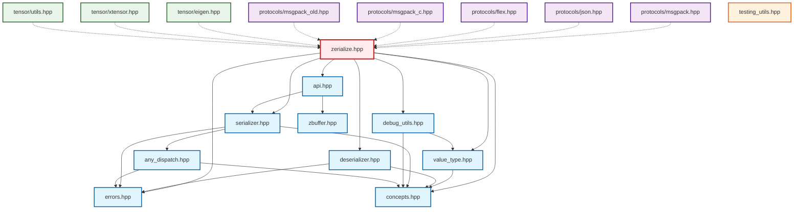

# Zerialize



## File Organization

### Core Library Structure

The library is organized into a clean, modular structure:

- **Main Header**: `zerialize.hpp` - Single include for most users
- **Core Components**: Essential building blocks (concepts, base classes, errors)
- **API Layer**: User-facing serialization functions and convenience helpers
- **Utilities**: Debug tools and testing utilities

### Dependency Layers

1. **Foundation Layer**: `errors.hpp`, `concepts.hpp` (no internal dependencies)
2. **Core Layer**: `value_type.hpp`, `deserializer.hpp`, `any_dispatch.hpp` (depend on foundation)
3. **Serialization Layer**: `serializer.hpp` (depends on core + any_dispatch)
4. **API Layer**: `api.hpp` (depends on serializer + zbuffer)
5. **Utility Layer**: `debug_utils.hpp` (depends on concepts + value_type)

### Optional Extensions

- **Protocols**: Format-specific implementations (MessagePack, JSON, Flex)
- **Tensor Libraries**: Integration with Eigen, XTensor
- **Testing**: Utilities for testing and validation

### Usage Patterns

**Simple Usage**: Just include `zerialize.hpp`
```cpp
#include <zerialize/zerialize.hpp>
```

**Advanced Usage**: Include specific components for faster compilation
```cpp
#include <zerialize/serializer.hpp>  // Serialization only
#include <zerialize/protocols/json.hpp>  // JSON protocol
```
